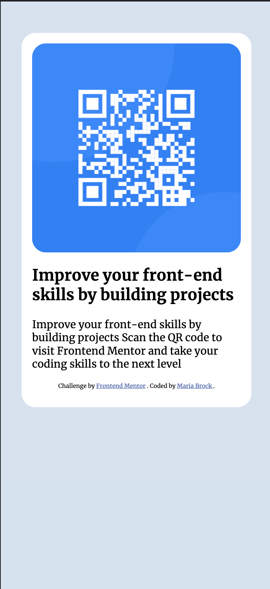
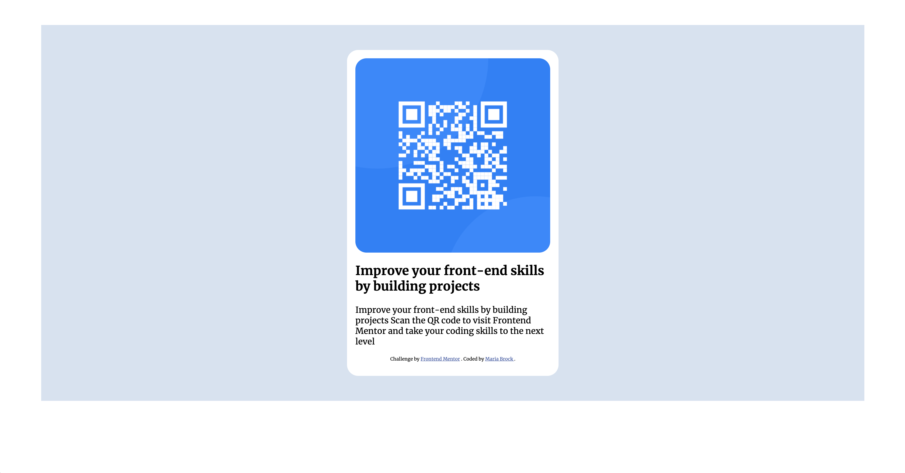

# Frontend Mentor - QR code component solution

This is a solution to the [QR code component challenge on Frontend Mentor](https://www.frontendmentor.io/challenges/qr-code-component-iux_sIO_H). Frontend Mentor challenges help you improve your coding skills by building realistic projects. 

## Table of contents

- [Frontend Mentor - QR code component solution](#frontend-mentor---qr-code-component-solution)
  - [Table of contents](#table-of-contents)
  - [Overview](#overview)
    - [Screenshot](#screenshot)
    - [Links](#links)
  - [My process](#my-process)
    - [Built with](#built-with)
    - [What I learned](#what-i-learned)
    - [Continued development](#continued-development)
    - [Useful resources](#useful-resources)
  - [Author](#author)
  - [Acknowledgments](#acknowledgments)

## Overview

### Screenshot




### Links

- Solution URL: [Github Repo](https://github.com/mariabrock/qr-code-not-angular)
- Live Site URL: [Github Pages](https://mariabrock.github.io/qr-code-not-angular/)

## My process

### Built with

- Semantic HTML5 markup
- CSS custom properties
- Flexbox
- CSS Grid
- Mobile-first workflow
- [Bootstrap 5](https://getbootstrap.com/) - For styles

### What I learned

This was the starter project with Frontend Mentor. It was a fun chance to keep things as simple as possible.

```css
@media (max-width: 576px) {
    .container {
        background: hsl(212, 45%, 89%);
        height: 100%;
        margin: 0;
    }
}
```

### Continued development

I look forward to using this component in a larger project.

### Useful resources

- [Bootstrap Docs](https://getbootstrap.com/) -  All the Bootstrap CSS things.
- [Stack Overfloe](https://stackoverflow.com/) - Good for specific questions

## Author

- Website - [Maria Brock](https://www.mariabrock.tech/)
- Frontend Mentor - [@mariabrock](https://www.frontendmentor.io/profile/yourusername)
- LinkedIn - [Maria Brock](https://www.linkedin.com/in/maria-brock/)

## Acknowledgments
